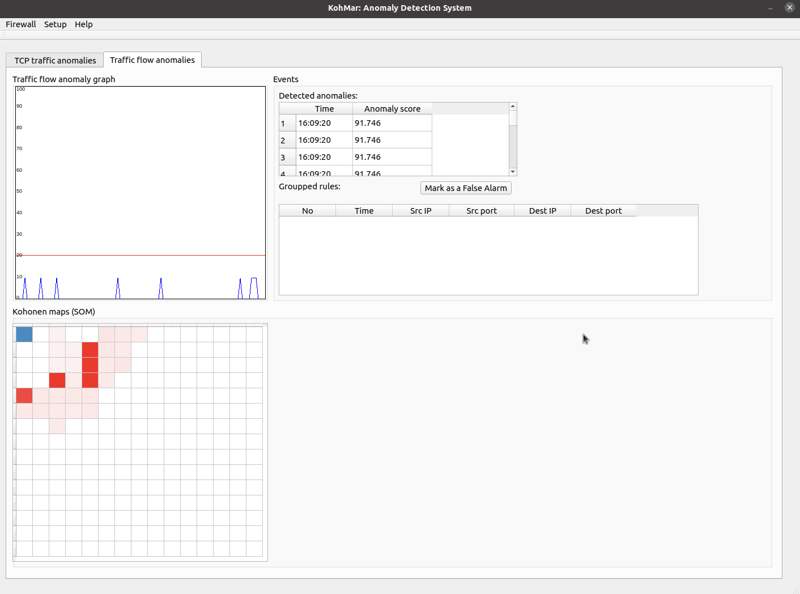

# kohmar-firewall
MVP: Anomaly Detection System for network traffic in real-time using Markov chains and Kohonen SOM

Variable-order Markov chain is used to represent TCP traffic states.
SOM model is used to obtain traffic blurring using some metrics, than cluster it and compare 
anomaly score with pretrained information. 

To obtain the traffic, it used self high-performance solution comprising a kernel module, packet_mmap and queues/threads 
to process the new packets. 

Initially developed for x86_64, but now it was tested only with Ubuntu/ARM64 and 5.13.0-32-generic Linux Kernel.

Work with my student Roman. 
Currently it is only in a research state. Probably, I will add some other detectors/metrics/UI and make proper evaluation of it,
but I have almost no time to work on it. Also I am interesting on some formalization of the logics and prove some theories on it.

Software architecture to be presented at <a href = "https://www.icin-conference.org">ICIN 22 conference</a>.

Installation and running: 
1. make the .ko module in ./netfilter using make 
(to build for ARM I had to run in addition: sudo cp /sys/kernel/btf/vmlinux /lib/modules/`uname -r`/build; sudo apt install dwarves)
3. make the starter app in ./drvctl (qmake/Qt creator)
4. make userspace ADS in ./ADS (qmake/Qt creator).
5. copy *.samples *.settings *.conf from ADS to a build targert dir. 
6. edit ./drvctl/module.conf to specify a network interface 
7. run sudo ads_drvctl start in ./drvctl and check if no errors
8. run ADS in ./ADS
9. ping the specified interface, debug output should scroll. Run youtube/etc to test. Anomaly graph should paint points.
10. currently it should just to show anomalies but do not apply the minied rules. 
11. it comes with very simple training sets. Record your training sets using a menu (especially for SOM). 

